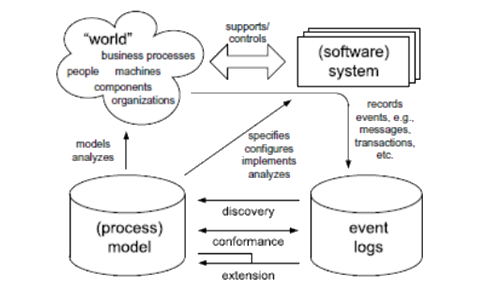
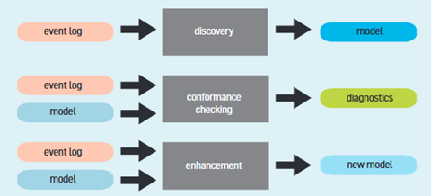
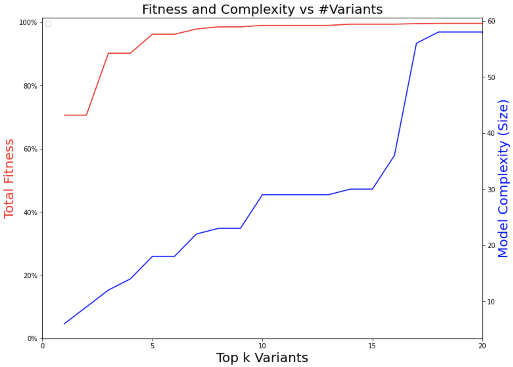
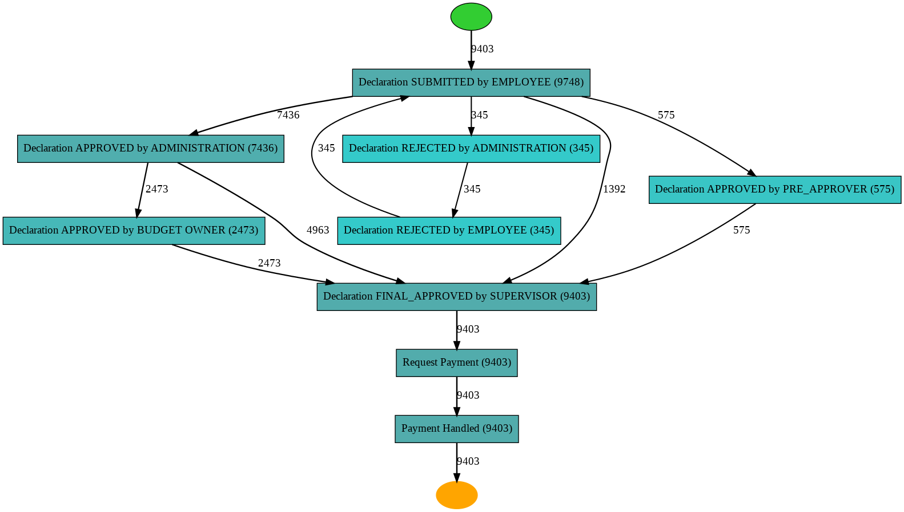

---
title: 'Ferret Miner: A Process Mining Case Study'
date: "December 2022"
author:
  - Martin Alvarez-Lopez^[MS in Software Engineering, San José State University]
  - Hardy Leung^[MS in Artificial Intelligence, San José State University]
  - Carlos Hernandez^[MS in Computer Engineering, San José State University]
  - Divyam Sobti^[MS in Artificial Intelligence, San José State University]

header-includes: |
  \usepackage{booktabs}
  \usepackage{caption}
---

# Abstract

The present project analyzed event data logs from the travel reimbursement process at Eindhoven University of Technology (ETU/c). The objective is to identify the bottlenecks in the process of travel declaration and improve its efficiency. Using Process Mining techniques, a control-flow model and a value stream map was generated to help identify any delays in the process. Subsequently, bottlenecks were detected using a representative analysis. The implementation results recognized bottlenecks in critical tasks of the process that were optimized by assigning more resources to the area. The optimized process improved its efficiency, compared with the original,  by almost 30%, significantly reducing the time processing of the travel reimbursement. 

# 1 Introduction

Process mining consists of a group of analysis techniques that reveal core information from processes through event data logs [@What2022]. Error and deficiencies can be detected using this methodology. Process mining and data mining are two different, but closely related data analytical systems since both belong to the business intelligence field. However, data mining concentrates on finding data relationships, whereas process mining focuses on analyzing data as well but from a systematic perspective.
Currently, information systems, such as Enterprise Resource Planning (ERP), Work on Management Systems (WMS) or Customer Relationship Management (CRM), are vital tools for the execution of almost any company process [@Tuto2022]. The essence of these information systems relies on their capabilities of logging events. An event log is basically a record of an activity performed with a 
timestamp embedded [@Proc2022]. Event logs facilitates process mining to discover information by tracking the chronology of the tasks and their execution time registered in each log.

## 1A Problem Description

This project performs a process mining analysis to detect patterns, delays and bottlenecks that obstruct the efficient flow of the process activities. The main objective is to provide a case study assessment using a dataset with real information provided from the Eindhoven University of Technology. The research data is from the BPI Conference 2020 held in Padova, Italy [@BPI2020].

The appropriate supervision of a business behavior enables the opportunity to adjust any task process that is generating a problem [@LeAl1994]. Therefore, our approach focuses on studying the problem using process mining methodology. Process mining is an outstanding data analysis technique that generates models representing the behavior indicated by activity logs produced by business applications after the execution of a process task.

Our approach proposes a real case study analysis using process mining technique.  We utilize a structured dataset based on systematic event logs. The system logs provide a detailed record of the process task, identification, resource, timestamp, and other data. These attributes provide insights of successful execution of the process, or any other problem encountered at any stage of the activities process flow.  

The fundamentals of our approach were introduced by Wil Van Der Aalst in his paper titled ``Process Mining'' [6], where process mining guidelines are detailed. In general, a process mining implementation covers three main issues: 1) Discovery, 2) Conformance, and 3) Enhancement. Our project focuses on the Discovery since it is the area that requires more effort, and it is the most deterministic for the success of the analysis. 

## 1B Motivation

Practical application publications are scarce, and our research paper aims to add support to this section. Furthermore, another motivation to complete this investigation relies on the fact of resolving a real problem using process mining techniques implemented with python PM4PY library modules. We found python PM4PY a stable open-source library available for everyone with great capabilities to resolve our problem. The goal is to demonstrate the practicality of process mining analysis in practice. Our paper illustrates a case study in the processing of travel reimbursement for a university in Germany.  The travel reimbursement issue involves several business processes for which analysis of event logs registration is worthwhile. The case being developed involves s number of students who submitted their application, added their support documentation and a series of tasks that need to be validated before the disbursement approval.

## 1C Approach Summary

The document is structured as follows:
Section 1 provides details about process mining and its fundamentals; Section 2 presents an overview of our approach and related literature review; Section 3 analyzes the outcomes produced from our primary studies and research problem. Section 4 refers to discussion. Finally, Section 5 concludes the work.

# 2 Survey 

The literature review for process mining related topics concentrates on the development of innovative techniques and algorithms from a control-flow discovery perspective and its applications. 

## 2A Process Mining 

The position of process mining considering other disciplines is just between data mining  and process  modeling [@van2004].
Such interaction is represented in figure one. 

<figure style='width:100%'>

<figcaption align = "center">
        <b>\phantom{..}Figure 1 \textit{General outline of process mining approach.}
</b>
</figcaption>
</figure>

Usually, information system databases do not have clearly defined structures which means that a process mining analysis must search and separate the information directly from the system. Under these terms, process mining is considered a technique where the event logs possess the right information to determine the behavior of the system. Event logs, then, are guidelines that dictate the applicability of a process mining implementation [@van2012]. As a result, process mining approach embraces three main actions (Figure 2):  
1) Discovery, which creates models by analyzing event logs
2) Conformance checking, which basically enables to compare a newly created model versus a predefined model to gain knowledge
3) Enhancement, which deals with the implementation of solutions to overcome previously detected problems. 

General outline of process mining approach

<figure style='width:100%'>

<figcaption align = "center">
        <b>\phantom{..}Figure 2 \textit{Process mining layout.}
</b>
</figcaption>
</figure>

## 2B Process Models

Distinct data analysis approaches have been developed to discover processes from event logs. However, Petri Nets technique has taken relevance over the others [@Cook1998].
Another approach utilizes Unified Modeling Language (UML) diagrams [@Sait2019].  Furthermore, A novel design named “alpha algorithm” is capable of depicting event data logs into work-flow diagrams, which is a derivation from Petri nets. Nowadays, a popular model is “Heuristic Miner”. One main characteristic of this method is to be highly permissive to distinct statistical levels and thresholds adjusted by the user [@Weij2006]. In order to deal with the massive number of events that actual information systems generate, Burattin et al. [@Bura2014] developed a Heuristic Miner adaptation based on Lossy Counting, as well as a sliding window that effectively analyzes streams of real datasets. 

## 2C Applications

Most work-related publications are dedicated mainly to the enhancement of novel methodologies and algorithms with significant emphasis on the control-flow discovery area [7]. However, the public services area has been common for process mining development research. For instance, a Genetic Miner approach was tested by Alves de Madeiros et al. [@deMe2007] in Dutch municipalities. Additionally, van del Aalst et al. [@RoDJ2009] applied an analysis of organizations in another municipality process. Rozinat et al. [@RoMa2009] evaluated process models in two different case studies on the public sector. Nonetheless, all these research applications are focused to validate and assess rather than enhance the process. Implementation of process mining approaches have been also developed in the private domain. Distinct discovery approaches were deployed by Goedertier et al. [@GoDW2011] in the telecom field. Also, Mans et al. [@MaSc2008] and Rebuge and Ferreira
[@Rebu2012] created a convoluted process mining method to resolve the tracking of patients within the healthcare industry.

The aforementioned literature review provides the fundamentals of process mining from a general perspective. Each approach makes its own significant contribution to the process mining study field, and in this paper, we focus on its application. 

# 3 Technical Approach 

using proper mathematical notation and formatting

# 4 Experimental Methodology

description of your data set, the results you found (formatted as either tables or plots with proper labels and captions), and a discussion of your results.  If you did a theoretical project, you should have an expanded technical approach instead of this section

## 4A Dataset Description

## 4B Results (include tables and Plots)

## 4C Discussion of Results

# 5 Future Work

## 5A Conformance Analysis

Once we have developed a process model either extracted through process discovery, or built on some reference guidelines. It would be interesting to investigate further into conformance checking to see how well the data fits the model, while in turn would help us evaluate and improve on the model.

This can be done with a method called token-based replay (TBR) on the Petri-net converted from the process model. For each trace, we would try to see if it can be executed on the petri-net in a mathematically sound way, keeping track of additional tokens added to avoid deadlock, and check for unused tokens at completion. We define the total fitness simply as the percentage of traces that fit the model. Another technique is alignment analysis, which is similar to TBR, except that events of a trace are aligned to a legal and model-fitting trace trajectory subject to certain cost functions. TBR and alignment analysis would both identify non-conformance, but the latter is more informative, although it comes at the expense of runtime complexity. Behavior analysis entails the analysis of concepts that are present in the event log but either impossible or expensive to capture in the event formalism (e.g. the person who submits the request cannot be the same person who approves). These techniques can be used to better identify the hows and whys of non-conformance, and to build better models.

Getting to 100% total fitness is not necessarily a desired goal. Instead, what we seek is a tradeoff. On the one hand, you want the model to be robust enough to elegantly explain the process. On the other hand, we do not want to over-build the model to make it so complex that it is hard to reason about.
Let’s use our specific problem as an example. We ran an experiment to examine such relationships. We ran the inductive miner on different values of k, where k is the number of top variants we used to build the model.
And we ran the conformance check to get the total fitness, and wrote code to examine the model. In this figure, the red line is the total fitness, and the blue line is the size of the model. We see that, as we include more traces, the model gets more complex, but the fitness also improves. If we would include only the top 3 variants, we can explain 90% of the traces. But if we blindly up the ante to 18 variants, we can now account for 99% of the traces, but the model is 5 times bigger, and much harder to understand.

<figure style='width:100%'>

<figcaption align = "center">
        <b>\phantom{..}Figure 3 \textit{Fitness and Complexity vs Top $k$ Variants.}
</b>
</figcaption>
</figure>

The sweat spots happen at k = 5, which can explain 96% of the traces. The heuristics map, shown in Figure 4, is quite easy to understand. And it can properly capture the submission, approval, rejection, resubmission, and the final payment.

<figure style='width:100%'>

<figcaption align = "center">
        <b>\phantom{..}Figure 4 \textit{Heuristics Net when using the Top 5 Variants.}
</b>
</figcaption>
</figure>

We have only scratched the surface of conformance analysis, as much more can be done.

## 5B Machine Learning and Timely Analysis

Another area of interest is to apply machine learning techniques to perform (1) flow analysis to predict likelihood of resubmission, rejection, payment delay, or over-budget based on other variables (time since submission, request amount, prior owner approval), and (2) timing analysis to determine mean-time-to-trace-completion. This provides important clues to administrators and employees alike about the time frame of payment in the best-case scenario.
We are also interested in detecting non-compliance “as it happens” and sending alerts to administrators.

# 6 Conclusion

A brief conclusion

# References

# Appendix: Team Contributions

In this section we have to describe what/where each team member work on (according to project guidelines on CANVAS)

